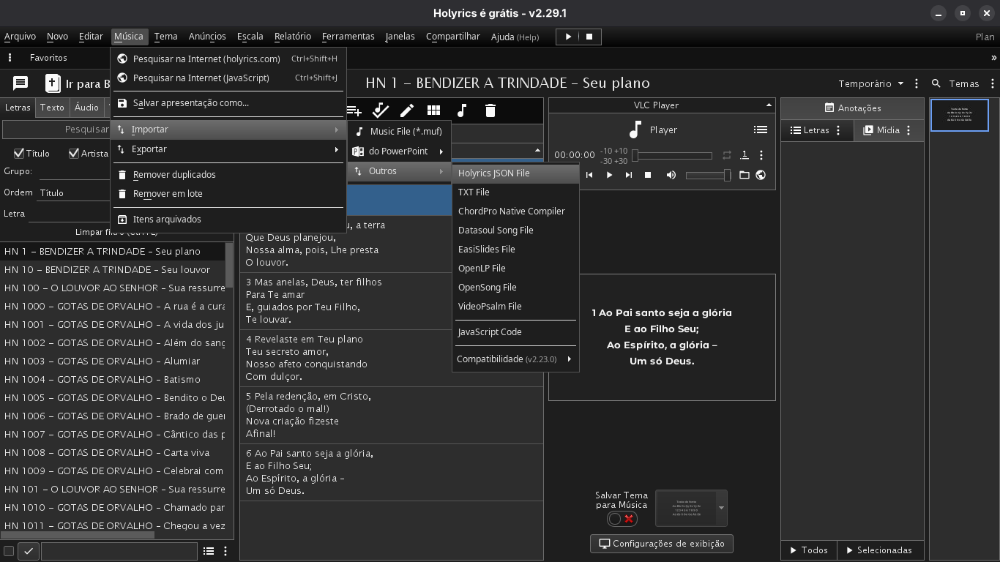

# Holyrics File JSON

Este repositório disponibiliza um arquivo **Holyrics File JSON** para importar músicas diretamente no Holyrics.

## Como importar

1. Baixe o arquivo `.json` deste repositório.
2. Abra o **Holyrics**.
3. Acesse o menu **Músicas**.
4. Clique em **Importar**.
5. Selecione **Outros**.
6. Clique em **Holyrics File JSON**.
7. Localize o arquivo `.json` que você baixou.
8. Confirme a importação e aguarde a conclusão.

## Tutorial visual

Adicionei abaixo um print mostrando o menu **Músicas** aberto.

> **Caminho:** **Músicas → Importar → Outros → Holyrics File JSON**

## Observações

- O arquivo importará todas as músicas contidas no JSON.
- Caso já existam músicas com o mesmo nome, o comportamento dependerá das configurações do Holyrics.
- É recomendável fazer um backup da sua biblioteca antes da importação.

## Download

📥 **[Baixar arquivo JSON](https://raw.githubusercontent.com/l3yAlberto/hinos-aev-holyrics/refs/heads/main/Holyrics.json)**
